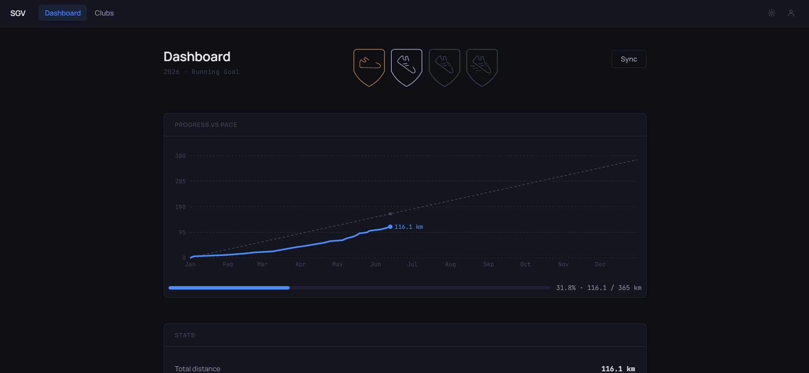
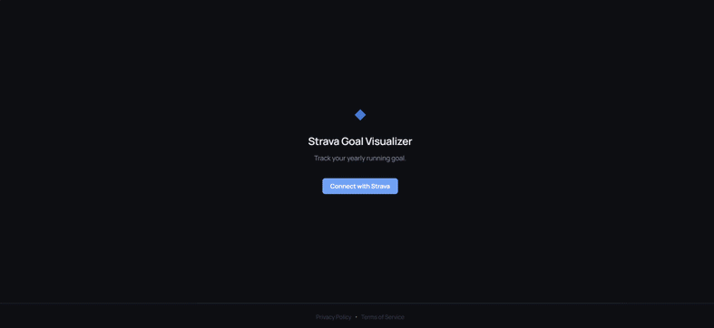
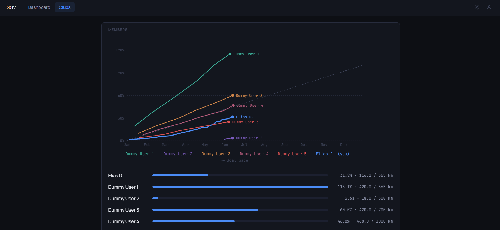

<h1 align="center">Strava Goal Visualizer</h1>

<p align="center">
  <em>A personal running goal tracker that visualises your yearly Strava progress.</em>
</p>

<p align="center">
  <a href="LICENSE"></a>
  
  
</p>

<p align="center">
  
</p>

## Table of Contents

- [Overview](#overview)
- [See it in action](#see-it-in-action)
- [Features](#features)
- [Screenshots](#screenshots)
- [Tech Stack](#tech-stack)
- [Prerequisites](#prerequisites)
- [Local Development](#local-development)
- [Docker Compose](#docker-compose)
- [Generating Secret Keys](#generating-secret-keys)
- [Running Tests](#running-tests)
- [Documentation](#documentation)
- [Strava API Compliance](#strava-api-compliance)
- [License](#license)

## Overview

Strava Goal Visualizer connects to your Strava account and tracks your progress towards a yearly running distance goal. Set a target in kilometres, sync your activities, and watch the pace chart fill in as the year progresses — giving you an honest read on whether you're ahead or behind the expected pace at any point in the year.

Beyond personal goals, the app shows club progress: each member's cumulative distance plotted on a shared chart, so you can see at a glance how the whole group is tracking. Achievements unlock at milestone distances (10 / 100 / 365 / 1,000 km), and the dashboard updates whenever you choose to sync.

The app is self-hosted — you run your own instance with your own Strava API credentials. No third-party service stores your data.

## See it in action

<p align="center">
  
</p>

## Features

- Personal yearly running goal dashboard with cumulative pace chart
- On-pace indicator — shows whether you're ahead or behind at today's date
- Achievement badges at 10 / 100 / 365 / 1,000 km milestones
- Club member progress view with per-member pace lines
- Strava OAuth login — no password required
- Self-hosted on Fly.io with a single-command deploy

## Screenshots

**Personal dashboard** — cumulative pace chart and on-pace indicator:

<p align="center">
  
</p>

**Achievement badges** — unlock at 10, 100, 365 and 1,000 km milestones:

<p align="center">
  
</p>

**Club dashboard** — per-member pace lines towards individual goals:

<p align="center">
  
</p>

## Tech Stack

| Layer | Technology |
|---|---|
| Backend | FastAPI (Python 3.12), SQLAlchemy async, Alembic |
| Frontend | React 18, Vite, TypeScript, Recharts |
| Database | PostgreSQL 16 |
| Auth | Strava OAuth 2.0, signed session cookies |
| Deployment | Fly.io (single-app), Docker multi-stage build |

## Prerequisites

- [uv](https://github.com/astral-sh/uv) — manages Python 3.12 automatically
- [Node.js](https://nodejs.org/) **22** — for the React frontend
- [Docker](https://www.docker.com/) — for running PostgreSQL locally
- `make` — used for dev commands (built-in on macOS/Linux; install on Windows)

### Windows: install prerequisites

Open **PowerShell** (not Git Bash) and run:

```powershell
# uv (Python manager)
powershell -ExecutionPolicy ByPass -c "irm https://astral.sh/uv/install.ps1 | iex"

# make — pick one:
winget install GnuWin32.Make          # requires winget (pre-installed on Windows 11)
# or: scoop install make              # requires https://scoop.sh
# or: choco install make              # requires https://chocolatey.org
```

Restart your terminal after installing.

#### No make? Run commands manually

```powershell
uv sync --group backend --group dev
cd frontend; npm install; cd ..
uv run pre-commit install --hook-type pre-commit --hook-type commit-msg
```

## Local Development

```bash
# 1. Clone and enter the repo
git clone <repo-url>
cd strava-goal-visualizer-2

# 2. Copy and fill in environment variables
cp .env.example .env
# Edit .env with your Strava credentials and generated secrets

# 3. Install all dependencies (backend Python + frontend Node)
make install-dev

# 4. Start PostgreSQL
docker compose up db -d

# 5. Run database migrations
uv run alembic upgrade head

# 6. Start the backend (in one terminal)
uv run uvicorn backend.main:app --reload --port 8000

# 7. Start the frontend (in a separate terminal)
cd frontend
npm run dev
```

- Backend API: http://localhost:8000
- Frontend: http://localhost:5173
- Swagger docs: http://localhost:8000/docs

## Docker Compose

**Prerequisites:** Docker with Compose plugin.

```bash
# 1. Copy and fill in environment variables
cp .env.example .env

# 2. Build and start all services (db, backend, frontend)
docker compose up --build

# 3. Verify
curl http://localhost:8000/health     # → {"status":"ok"}
curl http://localhost:8000/health/db  # → {"db":"ok"}
# Frontend: http://localhost:5173
```

## Generating Secret Keys

Run these once and paste the output into `.env`:

```bash
# SESSION_SECRET_KEY
python -c "import secrets; print(secrets.token_hex(32))"

# TOKEN_ENCRYPTION_KEY
python -c "from cryptography.fernet import Fernet; print(Fernet.generate_key().decode())"
```

## Running Tests

Docker must be running (tests spin up a throwaway Postgres via testcontainers).

```bash
make test
```

## Documentation

| Document | Description |
|---|---|
| [docs/ops/deployment.md](docs/ops/deployment.md) | Production deployment guide (Fly.io) |
| [docs/ops/db-statistics.md](docs/ops/db-statistics.md) | DB usage statistics queries |
| [docs/design.md](docs/design.md) | Architecture and design decisions |
| [docs/design/style.md](docs/design/style.md) | Frontend design system |
| [docs/workflow.md](docs/workflow.md) | Development workflow |
| [docs/learnings.md](docs/learnings.md) | Project learnings and gotchas |
| [docs/epics/backlog.md](docs/epics/backlog.md) | Full task backlog |

## Strava API Compliance

> ⚠️ **This project does not comply with Strava's API Agreement and API Policy, and is not being continued for that reason.** It is a personal learning project, not an approved Strava application. Read this before running or reusing the code.

The app was built around the **club progress feature** — showing each club member's running progress on a shared chart. That feature turned out to be incompatible with Strava's developer terms, which is why the project was wound down rather than submitted for approval:

- **Showing other athletes' data is prohibited.** Strava's [API Agreement](https://www.strava.com/legal/api) (effective 2024-11-11) requires that *"Strava Data provided by a specific user can only be displayed or disclosed in your Developer Application to that user"* — even for data that is publicly viewable. The whole point of the club view (comparing members to each other) violates this.
- **The endpoints are going away.** The club feature relies on the Club Members / Club Activities endpoints, which Strava is deprecating on **2026-09-01**.
- **Data retention.** Activities are stored in PostgreSQL indefinitely; Strava's [API Policy](https://www.strava.com/legal/api_policy) states *"You may not retain Strava Data in your cache for longer than seven (7) days."*
- **Branding.** The product name contains "Strava" (prohibited by the [Brand Guidelines](https://developers.strava.com/guidelines/)) and the UI does not use the official "Connect with Strava" button or "Powered by Strava" attribution.

The app only ever ran in Strava's "Single Player Mode" (only the owner's account could connect), so no other users' data was exposed in practice. These findings are recorded in [EPIC-11 — Strava API Compliance](docs/epics/backlog.md). The lesson, kept here on purpose: for any integration, the platform's **legal agreement and policy** — not just the API docs — decide which features are allowed, and those terms can change after you build.

## License

MIT © 2026 Elias De Coppel — see [LICENSE](LICENSE).
